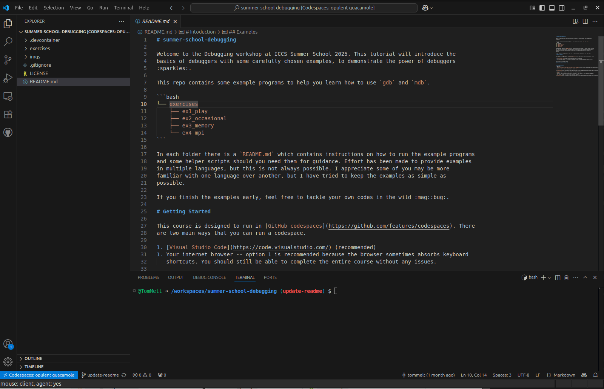
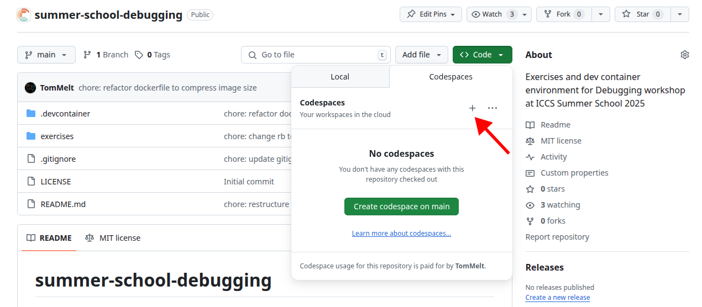
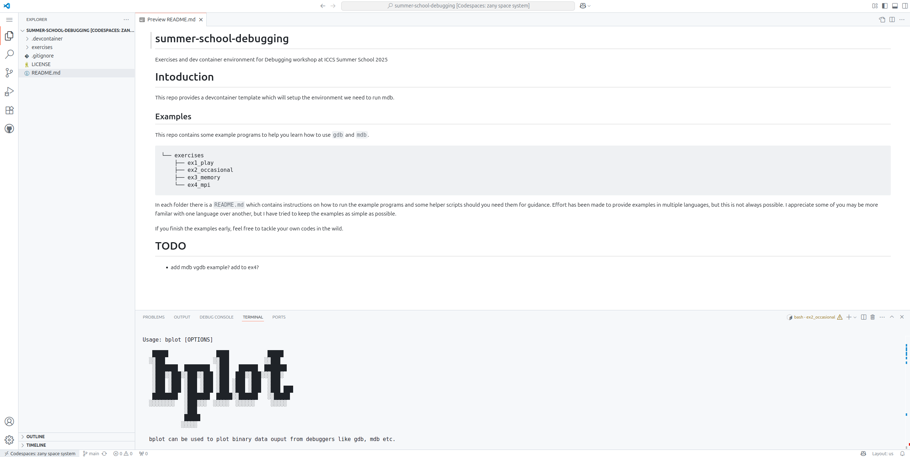

# summer-school-debugging

Welcome to the Debugging workshop at ICCS Summer School 2025. This tutorial will introduce the
basics of debuggers with some carefully chosen examples, to demonstrate the power of debuggers :zap:.

This repo contains some example programs to help you learn how to use `gdb` and `mdb`.

```bash
└── exercises
    ├── ex1_play
    ├── ex2_occasional
    ├── ex3_memory
    └── ex4_mpi
```

In each folder there is a `README.md` which contains instructions on how to run the example programs
and some helper scripts should you need them for guidance. Effort has been made to provide examples
in multiple languages i.e., C++ and Fortran. I appreciate some of you may be more familiar with one
language over another, but I have tried to keep the examples as simple as possible.

If you finish the examples early, feel free to tackle your own codes in the wild :mag::bug:.

## Getting Started

This course is designed to run in [GitHub codespaces](https://github.com/features/codespaces). There
are two main ways that you can run a codespace.

1. [Visual Studio Code](https://code.visualstudio.com/) (recommended)
1. Your internet browser -- option 1 is recommended because the browser sometimes absorbs keyboard
   shortcuts. You should still be able to complete the entire course without any issues.

Instructions are provided below.

> [!NOTE]
> GitHub codespaces provides free monthly usage of 120 core hours. We should only need 3 for this
> course. For more info on billing please see GitHub's
> [documentation](https://docs.github.com/en/billing/managing-billing-for-your-products/about-billing-for-github-codespaces#about-github-codespaces-pricing).

> [!NOTE]
> GitHub provides a default of 2 cores and 8 GB Ram, which is more than enough for this course. If
> you select 4 cores, when creating a new codespace it will use twice as many core hours from your
> allowance.

> [!NOTE]
> The first time you create this codespace it will take 2-3 minutes to load (whilst it pulls the
> docker image and runs initial setup). Re-connecting to a previous session will be much quicker.

### Running in Visual Studio Code

<details>
<summary>(click here to expand instructions)</summary>

1. Open VSCode
2. If you haven't already, download the
   "[GitHub Codespaces](https://code.visualstudio.com/docs/remote/codespaces)" extension
    - Click "Extensions" (or press `CTRL+SHIFT+X`)
      
    - Type "GitHub Codespaces"
      
3. Click on "Remote Explorer" in the side bar
4. If you haven't already, sign into your GitHub account
   
5. Click "Create Codespace"
   
6. Type "https://github.com/Cambridge-ICCS/summer-school-debugging" into the search bar and press
   the `Enter` key.
   
7. Click "**main** _Default Branch_"
   
8. Click "2 cores, 8 GB RAM, 32 GB storage"
   


9. This will connect to a remote instance of the GitHub codespace. You are now ready to start the
   course! :tada:

   

</details>

### Running in Browser

<details>
<summary>(click here to expand instructions)</summary>

1. Navigate to
   [https://github.com/Cambridge-ICCS/summer-school-debugging](https://github.com/Cambridge-ICCS/summer-school-debugging)

2. Click on the `+` icon to create a new on branch `main`
   

3. This will open a new tab in your browser with a VSCode interface connected to the GitHub
   codespace. You are now ready to start the course! :tada:
   

</details>

## Start the Course :computer:

Now that we have the codespace running in VSCode or the browser, we can get started with the course.
All of the following instructions will be the same regardless of how you setup your codespace.

Navigate into the exercises folder and start with exercise 1.

```bash
cd exercises/ex1_play/
```

Start reading through the `README.md` for that exercise i.e., `exercises/ex1_play/README.md`.
